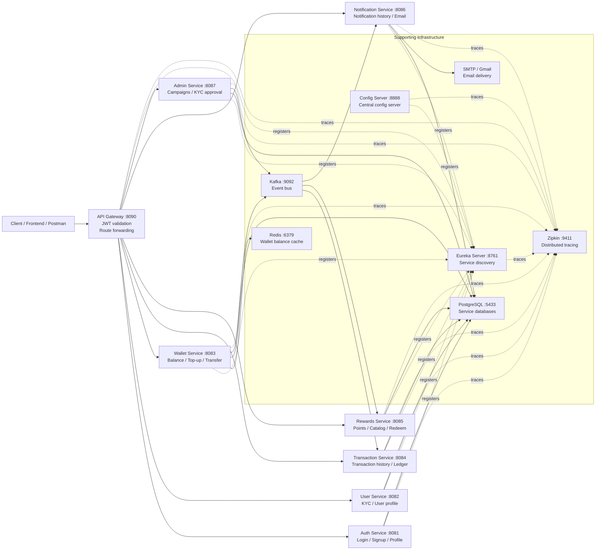
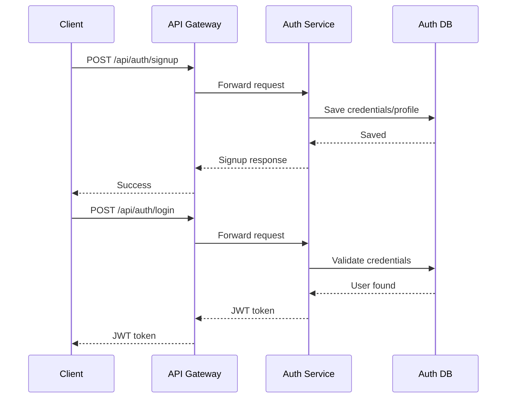
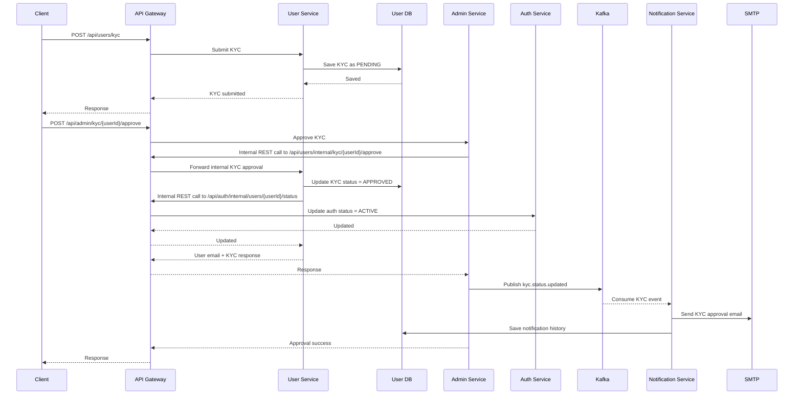
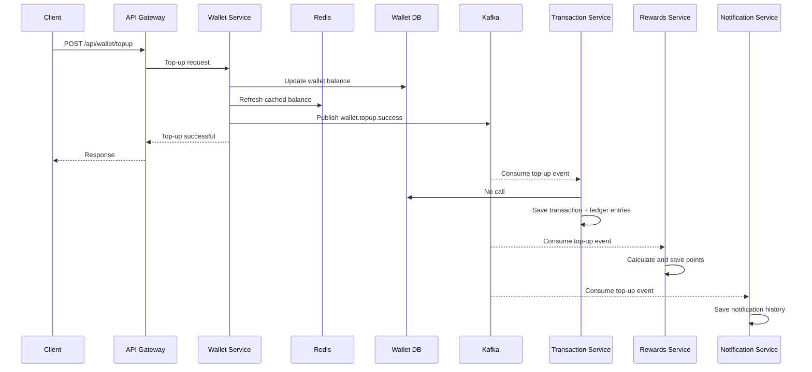
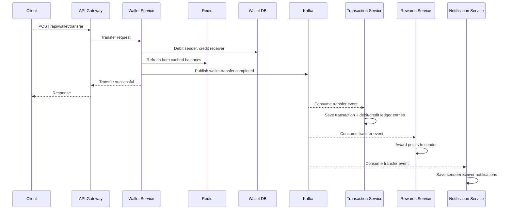

# Digital Wallet System HLD

This document shows the request flow, service-to-service communication, and sync/async integration points in the system.

## 1. Overall HLD

## 2. Request Entry Pattern

- External client calls always enter through `API Gateway`.
- Gateway adds `X-Internal-Gateway-Token`.
- Most secured routes also require JWT in `Authorization: Bearer <token>`.
- Backend services block direct access if `X-Internal-Gateway-Token` is missing.
- Gateway routes use `lb://service-name`, so routing is discovery-aware.

## 3. Synchronous vs Asynchronous Communication

### Synchronous REST

- `Client -> API Gateway -> Auth Service`
- `Client -> API Gateway -> User Service`
- `Client -> API Gateway -> Wallet Service`
- `Client -> API Gateway -> Transaction Service`
- `Client -> API Gateway -> Rewards Service`
- `Client -> API Gateway -> Admin Service`
- `Admin Service -> API Gateway(localhost:8090) -> User Service`
- `User Service -> API Gateway(localhost:8090) -> Auth Service`

### Asynchronous Event Flow via Kafka

- `Wallet Service -> Kafka topic wallet.topup.success`
- `Wallet Service -> Kafka topic wallet.transfer.completed`
- `Admin Service -> Kafka topic kyc.status.updated`
- `Transaction Service <- wallet.topup.success`
- `Transaction Service <- wallet.transfer.completed`
- `Rewards Service <- wallet.topup.success`
- `Rewards Service <- wallet.transfer.completed`
- `Notification Service <- wallet.topup.success`
- `Notification Service <- wallet.transfer.completed`
- `Notification Service <- kyc.status.updated`

## 4. Core Business Flow Diagrams

### 4.1 Signup and Login Flow

### 4.2 KYC Submission and Approval Flow

### 4.3 Wallet Top-up Flow

### 4.4 Wallet Transfer Flow

## 5. Service Responsibility Map

| Service | Main Responsibility | Talks To |
|---|---|---|
| API Gateway | Entry point, JWT validation, route forwarding | All business services, Eureka |
| Auth Service | Signup, login, token validation, user auth status | PostgreSQL |
| User Service | KYC submit/status, internal KYC operations | PostgreSQL, API Gateway -> Auth |
| Wallet Service | Balance, top-up, transfer | PostgreSQL, Redis, Kafka |
| Transaction Service | Ledger + transaction history | PostgreSQL, Kafka |
| Rewards Service | Reward points and catalog redemption | PostgreSQL, Kafka |
| Notification Service | Notification history and KYC email delivery | PostgreSQL, Kafka, SMTP |
| Admin Service | KYC approval/rejection, campaigns, dashboard | PostgreSQL, API Gateway -> User, Kafka |
| Eureka Server | Service registry | All services |
| Config Server | Central config host | Available in repo |

## 6. Important Communication Notes

- Wallet updates are immediate in `wallet-service`, but ledger/history/rewards/notifications happen asynchronously through Kafka.
- Because of that, `top-up` or `transfer` API response can come before transaction history or rewards summary gets updated.
- `Admin Service` does not directly call `User Service` by service name in current code; it calls `http://localhost:8090/...`, meaning it goes through API Gateway.
- `User Service` also updates `Auth Service` through API Gateway, not direct service-to-service discovery routing.
- `Redis` is used only by `wallet-service` for fast balance reads.
- `Notification Service` sends real email only for KYC status events; wallet top-up/transfer currently persist notification history.

## 7. Quick Flow Summary

- User onboarding flow: `Client -> Gateway -> Auth`
- KYC flow: `Client -> Gateway -> User -> Admin -> Gateway -> User -> Gateway -> Auth -> Kafka -> Notification`
- Wallet top-up flow: `Client -> Gateway -> Wallet -> Kafka -> Transaction + Rewards + Notification`
- Wallet transfer flow: `Client -> Gateway -> Wallet -> Kafka -> Transaction + Rewards + Notification`
- Rewards read flow: `Client -> Gateway -> Rewards`
- Transaction history flow: `Client -> Gateway -> Transaction`
